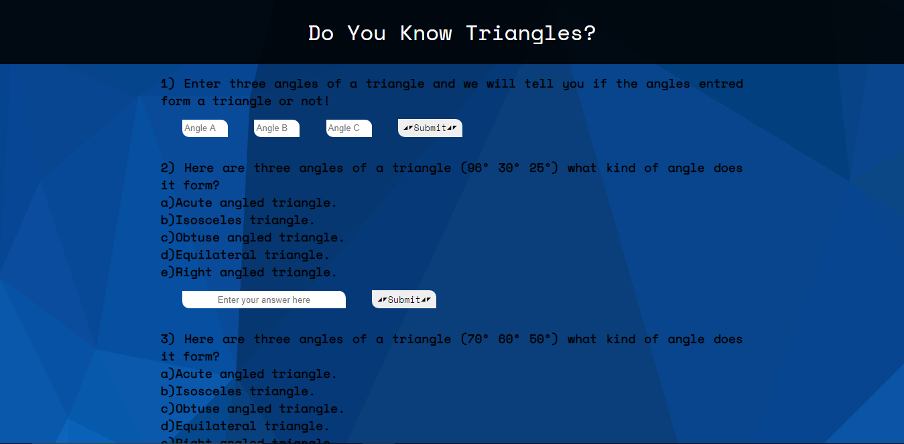

<!-- Please update value in the {}  -->

<h1 align="center">DO-YOU-KNOW-TRIANGLES?</h1>

  <h3>
    <a href="https://do-you-know-triangles.netlify.app/">
     >> Demo <<
    </a>   
  </h3>

<!-- OVERVIEW -->

## Overview

### About
 This is a fun quiz app about triangles, where you learn properties of triangles, calculate the area of the triangle. 

### Built With

<!-- This section should list any major frameworks that you built your project using. Here are a few examples.-->

- HTML
- CSS
- JavaScript

## Contact

- Website [ScriptoPlankton](https://sandeep.netlify.app/)
- GitHub [@sandeepashok](https://github.com/sandeepashok)

